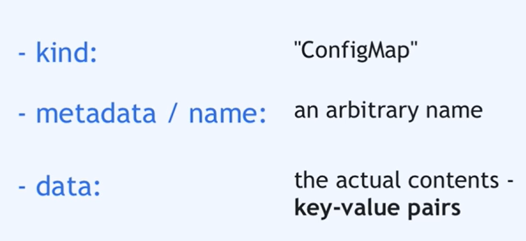
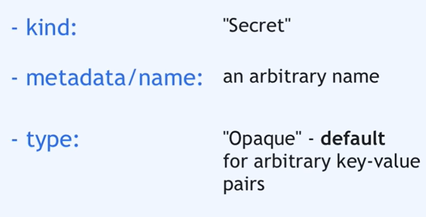
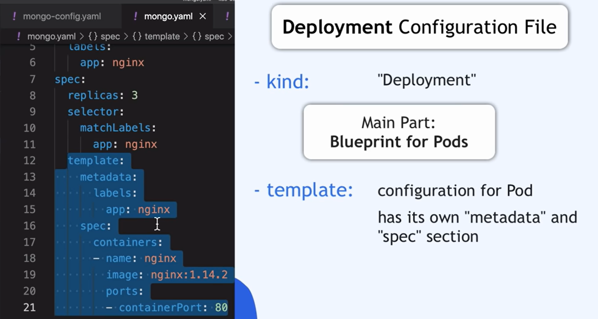
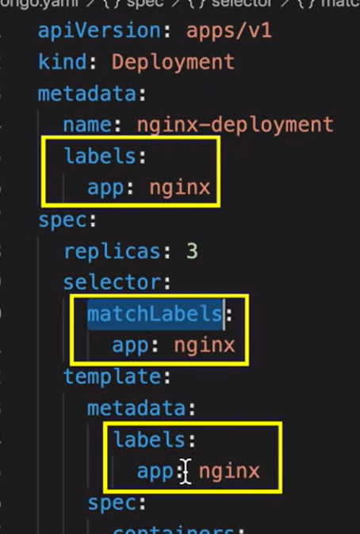
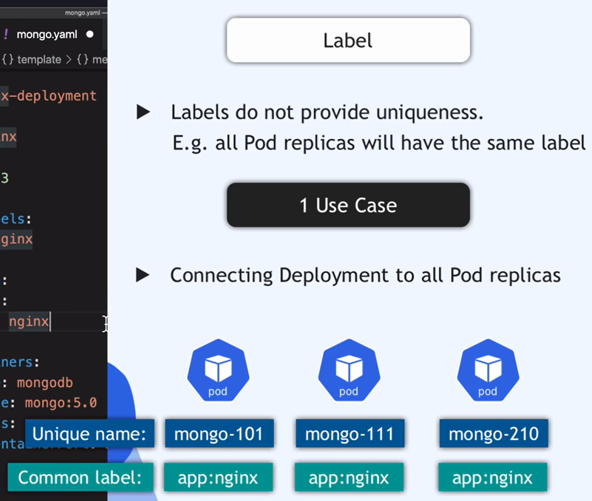
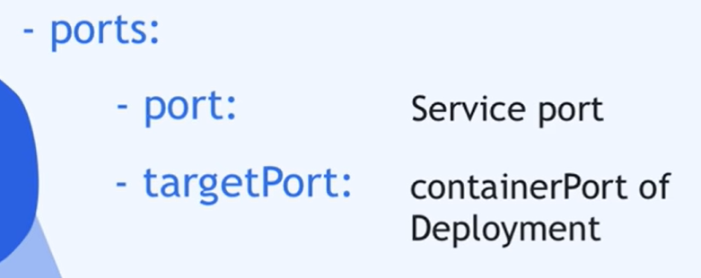
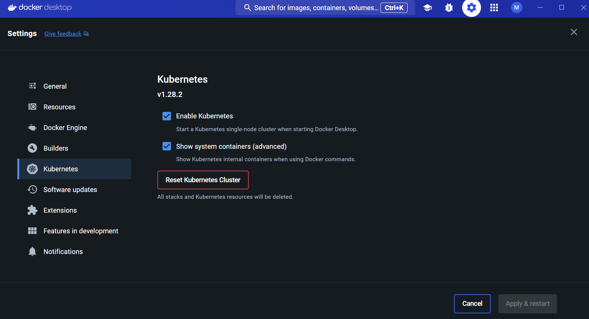

# Helm Chart and Kubernetes

# Nana example

In this folder, we will deploy the existing [application of nana](https://hub.docker.com/r/nanajanashia/k8s-demo-app) locally in mini kube.
We will write our own chart first, then transform it into a helm chart. And we will see the differences.

## Setup

! Atention:

There are several ways of trying minikube on Windows + docker:

- Docker Desktop app (with Enable Kubernetes option)
- Docker Desktop app (without enabling Kubernetes option) and installing minikube to wsl2
- No Docker Desktop at all, installing docker and minikube in wsl2

1 - [Install minikube](https://minikube.sigs.k8s.io/docs/start/)

2 - Install docker

- Minikube have docker pre-install inside of it, but in our local machine, Minikube itself will be packaged into a docker container.
  3 - start minikube indicating docker as a driver

```bash
minikube start --driver docker
```

4 - Check minikube status

```bash
minikube status
```

5 - kubectl is istalled together with minikube

6 - Use command to visualize minikube ready

```bash
kubectl get nodes
```

## Kubernetes configuration file

1 - mongo-config.yaml

Go to Kubernetes documentation and search for a template.


In this example we create mango-url linked to mongo-service (the mongo service name)

2 - mongo-secret.yaml



we create two variables mongo-user and mongo-password

the actual username and password should be encoded:

```bash
echo -n <user/password> | base64
```

3 - mongo.yaml with deployment and service, as all deployment has a service.



- The specification for a container:

  -Name: conventional
  -image: the image name in the registry and version
  -port: containerPort: the port of the container specified in the registry (in seo dash case, it is 8050)

- The labels:





Pods will have different name, but it has the same label if they came from the same deployment.

The selector matchLabels indicates that all pods with this label will belong to this deployment.

- --- sparate the yaml section

- service name and label:
  it just connect the name of the service with the Pods labels.

- service ports:



the port is any port that you choose, targetport is the port of containers.

Is a common standered to choose the same port.

4 - webapp.yaml: deployment and service:

Same logic above, just change name, label and image.

5 - How to configure enviroment variables running inside the container:

In mongo and webapp container, create env with name and get valuesFrom secret Key with secret variable / config.

6 - How to make Webapp externally accessible:

We create a external service for external Access.

In service configuration, we set a type to Node Port (that is one of the external service port)

nodePort: we should type anything between 30000 - 32726

In the local web we put <nodeip>:<nodePort> to access it.

## Create our configuration in Kubernetes:

1 - Checks: We found before that minikube is running but if we check now, we don't have any components deployed yet.

```bash
kubectl get pod
```

2 - We must create ConfigMap ans Secret before Deployments using the command. Database should start before the webapplication too, as the web application needs it.

```bash
kubectl apply -f <filename.yaml>
```

-f: file

3 - Check if all components are created:

```bash
kubectl get all
```

```bash
kubectl get configmap
```

```bash
kubectl get secret
```

4 - You can always get help in command line:

```bash
kubectl --help
kubectl get --help
```

5 - You can always get more information with kubectl describe:

```bash
kubectl describe <resourceType> <resourceName>
kubectl describe service webapp-service
```

6 - You can viasualize log and stream it:

```bash
kubectl logs <podName> -f
```

7 - How to access WebApp via Browser: NodePort Service is accessible on each Worker Node's IP address

As in minikube we just have one ip:

```bash
kubectl get node -o wide
```

we can use the ip in the internal-ip column.

Open in the browser using <minikubeip>:<nodePort>

- MY application coouldn't open it, I certificated every step was normal. It worked with the localhost link:

```bash
minikube service webapp-service --url
```

# [Kubernetes dashboard using kubernetes from docker](https://www.youtube.com/watch?v=NP8L8g1pjCQ)



1 - kubernetes setting

```bash
kubectl apply -f https://raw.githubusercontent.com/kubernetes/dashboard/v2.6.1/aio/deploy/recommended.yaml
kubectl proxy --append-server-path
```

2 - Open the dashboard in the link: http://localhost:8001/api/v1/namespaces/kubernetes-dashboard/services/https:kubernetes-dashboard:/proxy/

3 - Leave the page, Ctrl C and generate token

```bash
kubectl -n kube-system get secret

```

Or find a service account of kube-system, generate token for it, copy token and check if there is enters (delete enters) and use it on the browser.

```bash
kubectl -n kube-system get serviceaccount
kubectl -n kube-system create token <name of the service account, for example: attachdetach-controller>
```

# Choose kubectl context

```bash
kubectl config get-contexts
```

Use the command to list all clusters that you have access now

```bash
kubectl config current-context
```
Use this command to visualize in which cluster you are connected 

```bash
kubectl config use-context <clustername>
```
Use the command to switch to the desired cluster